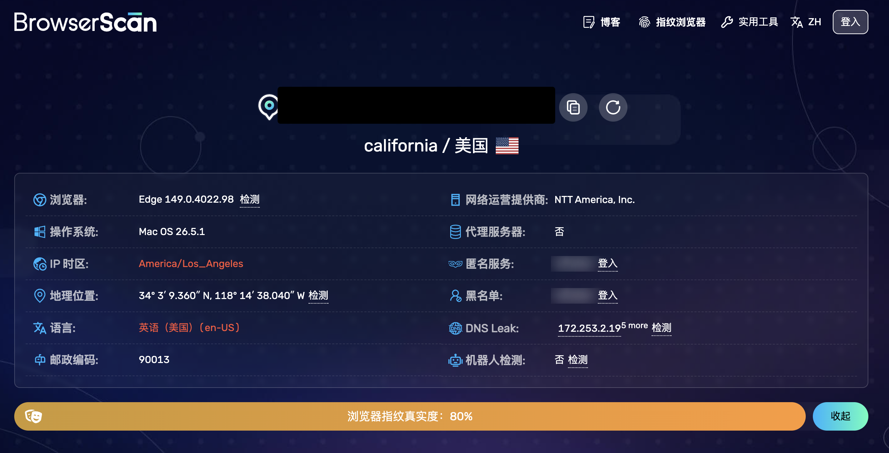
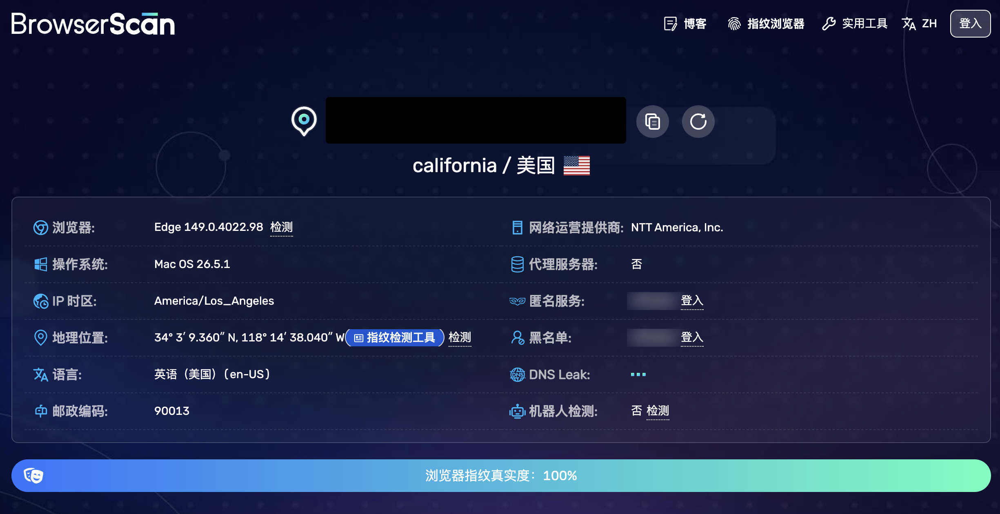
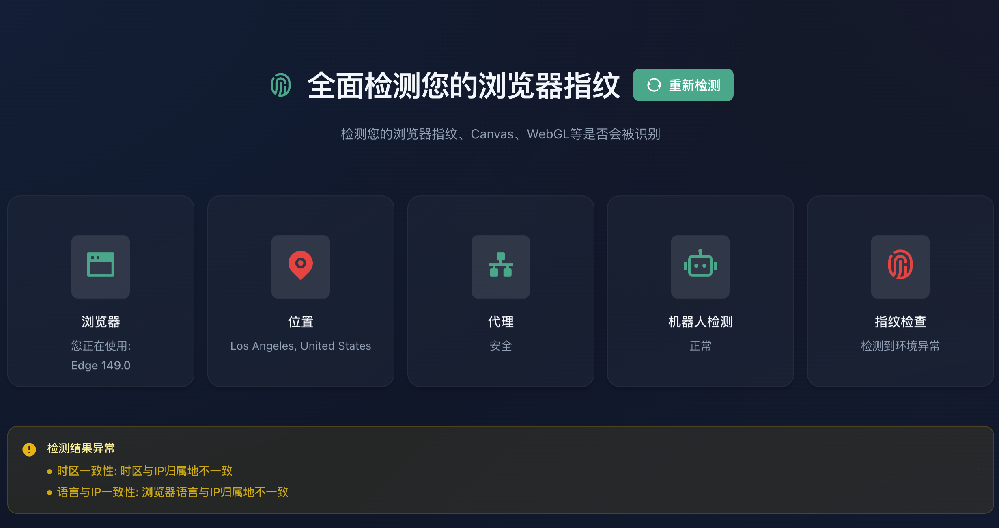
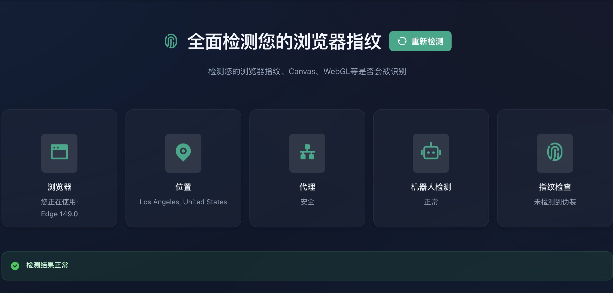
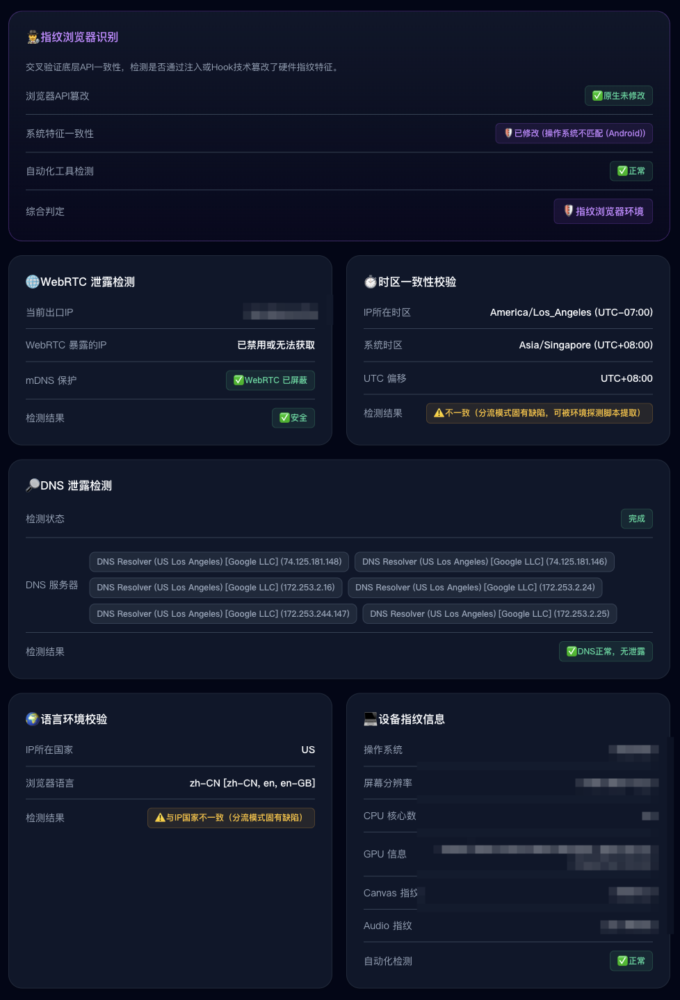
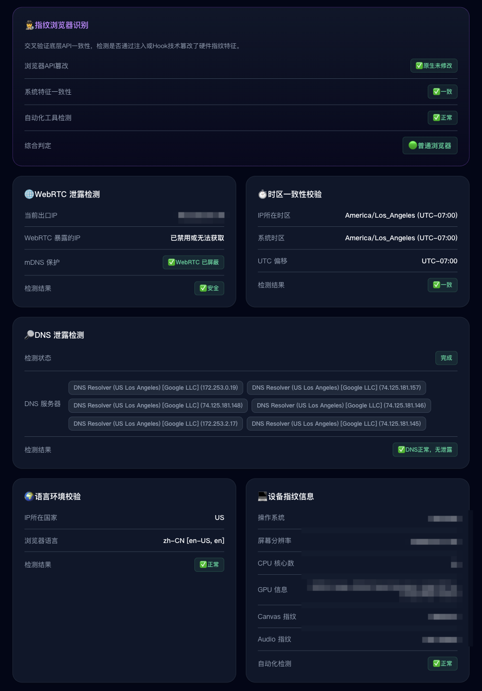

# VanishMe

<div align="center">

**浏览器隐私保护扩展 - 伪装你的浏览器指纹**

[](https://opensource.org/licenses/MIT)
[](https://www.google.com/chrome/)

[English](#english) | [中文](#中文)

</div>

---

## 中文

VanishMe 是一个强大的浏览器隐私保护扩展，帮助你伪装浏览器指纹，避免被网站追踪。支持地理位置、时区、语言、WebRTC 等多维度的隐私保护。

### ✨ 核心特性

- 🌍 **地理位置伪装** - 自定义经纬度、精度、随机偏移
- 🕐 **时区伪装** - 修改浏览器时区和 UTC 偏移
- 🌐 **语言伪装** - 自定义 navigator.language 和 Accept-Language
- 🔒 **WebRTC 防泄漏** - 防止真实 IP 通过 WebRTC 泄漏
- 🎯 **灵活匹配模式** - 支持全局、白名单、黑名单三种模式
- ⚡ **快速配置卡片** - 内置新加坡、日本、德国、美国、中国等预设
- 💾 **配置管理** - 支持自定义配置文件，导入导出分享
- 🛡️ **深度反检测** - 隐藏 API 修改痕迹，通过指纹检测网站

### 🚀 安装

#### 从 Release 安装

1. 前往 [Releases](https://github.com/XiNian-dada/VanishMe/releases) 下载最新的 `vanishme-v*.*.*.zip`
2. 解压缩文件
3. 打开 Chrome 浏览器，进入 `chrome://extensions/`
4. 启用右上角的"开发者模式"
5. 点击"加载已解压的扩展程序"，选择解压后的 `dist` 文件夹

#### 从源码构建

```bash
# 克隆仓库
git clone https://github.com/XiNian-dada/VanishMe.git
cd VanishMe

# 安装依赖
npm install

# 构建扩展
npm run build

# dist 文件夹即为扩展文件
```

### 📖 使用指南

#### 快速开始

1. 点击扩展图标打开弹窗
2. 在"快速配置"中点击一个预设国家/地区卡片
3. 确认应用配置
4. 刷新页面，配置即时生效

#### 匹配模式

VanishMe 支持三种匹配模式，让你灵活控制哪些网站需要伪装：

- **全局模式** - 对所有网站启用伪装
- **白名单模式** - 仅对列表中的网站启用（推荐）
- **黑名单模式** - 对除列表外的所有网站启用

**通配符支持：**
- `chatgpt.com` - 精确匹配
- `*.google.com` - 匹配所有子域名（如 mail.google.com, drive.google.com）
- `*openai*` - 匹配包含 openai 的所有域名

#### 完整配置页面

点击弹窗右上角的 ⚙️ 设置图标，或右键扩展图标选择"选项"，进入完整配置页面：

- **当前配置** - 使用标签页编辑地理位置、时区、语言、WebRTC 详细设置
- **预设配置** - 快速应用内置国家/地区预设
- **自定义配置文件** - 保存、编辑、导出、删除自己的配置方案
- **站点特定规则** - 为特定网站设置例外（优先级最高）
- **数据管理** - 导入导出完整配置，重置所有数据

#### 当前网站快捷操作

在弹窗的"当前网站"区域：
- 点击"启用"将当前网站添加到白名单（或从黑名单移除）
- 点击"不启用"将当前网站添加到黑名单（或从白名单移除）
- 操作后自动刷新页面使配置生效

### 🔧 技术特点

- **Manifest V3** - 使用最新的 Chrome 扩展 API
- **MAIN World 注入** - 直接在主页面上下文中修改 API
- **深度反检测技术**：
  - 使用 Proxy 包装函数，保持原生调用行为
  - Function.toString() 返回原生代码字符串
  - Object.getOwnPropertyDescriptor 返回原始描述符
  - 提前保存原生 API 描述符，防止检测
- **无痕修改** - 通过指纹检测网站测试

### 🛡️ 隐私检测网站测试

VanishMe 能够通过以下指纹检测网站的测试：

- [iprisk.top](https://iprisk.top/) - 显示为原生 API
- [BrowserLeaks](https://browserleaks.com/)
- [IPLeak](https://ipleak.net/)
- [Device Info](https://www.deviceinfo.me/)

#### 使用前后对比

<table>
  <tr>
    <th>使用前 (Before)</th>
    <th>使用后 (After)</th>
  </tr>
  <tr>
    <td></td>
    <td></td>
  </tr>
  <tr>
    <td></td>
    <td></td>
  </tr>
  <tr>
    <td></td>
    <td></td>
  </tr>
</table>

可以看到，使用 VanishMe 后，所有 API 都显示为原生状态，完全隐藏了修改痕迹。

---

## English

- **Geolocation Spoofing**: Control what location information websites can access
  - Custom latitude, longitude, and accuracy
  - Random coordinate generation within a radius
  - Position history tracking
  - Geolocation permission spoofing

- **Timezone Spoofing**: Modify timezone information at the JavaScript layer
  - Custom timezone selection
  - Custom UTC offset
  - Affects `Date` and `Intl.DateTimeFormat` APIs

- **Language Spoofing**: Control language-related information
  - Custom `navigator.language` and `navigator.languages`
  - Custom `Accept-Language` HTTP header
  - Intl API locale modification

- **WebRTC Leak Protection**: Prevent WebRTC from exposing your real IP address
  - Multiple policy options
  - Recommended: "Disable non-proxied UDP"
  - Uses Chrome's privacy API

### Profile System

- **5 Pre-configured Profiles**: Singapore, Japan, Germany, United States, China
- **Custom Profiles**: Create and manage your own environment profiles
- **Quick Switching**: Apply complete environment profiles with one click
- Each profile includes coordinated geolocation, timezone, and language settings

### Site-Specific Controls

- **Per-Site Rules**: Enable or disable protection for specific websites
- **Quick Toggle**: Right-click extension icon for site-specific controls
- **Global Toggle**: Turn all protection on/off instantly

### Privacy Testing

- **Built-in Leak Test Page**: Check what information websites can access
- **Real-time Testing**: Test geolocation, timezone, language, and WebRTC
- **Transparency**: See exactly what VanishMe is protecting

## Installation

### Prerequisites

- Node.js (v18 or later)
- npm or yarn

### Build from Source

1. Clone the repository:
```bash
git clone <repository-url>
cd VanishMe
```

2. Install dependencies:
```bash
npm install
```

3. Build the extension:
```bash
npm run build
```

4. Load in Chrome/Edge:
   - Open `chrome://extensions` (Chrome) or `edge://extensions` (Edge)
   - Enable "Developer mode"
   - Click "Load unpacked"
   - Select the `dist` folder

### Development Mode

For development with auto-rebuild:
```bash
npm run dev
```

## Usage

### Quick Start

1. Click the VanishMe icon in your browser toolbar
2. Toggle "Global Protection" on
3. Select a profile (e.g., "Singapore") and click "Apply Profile"
4. Click "Save"
5. Reload any open tabs to apply changes

### Popup Interface

The popup provides quick access to:

- **Global Protection Toggle**: Master on/off switch
- **Current Site Controls**: Enable/disable protection for the active site
- **Profile Selector**: Quick profile switching
- **Geolocation Settings**: Latitude, longitude, accuracy, randomization
- **Timezone Settings**: Timezone and offset configuration
- **Language Settings**: Language and Accept-Language header
- **WebRTC Settings**: IP leak protection policy
- **Leak Test**: Open the privacy testing page

### Options Page

Access advanced features:

- **Profile Management**: Create, edit, and delete custom profiles
- **Global Settings**: Configure default behavior
- **Site Rules**: View and manage per-site rules
- **Data Management**: Import/export configuration, reset to defaults

### Context Menu

Right-click the extension icon for quick actions:

- Enable/disable globally
- Enable/disable on current site
- Open leak test page
- Reset WebRTC policy

## Configuration Details

### Geolocation

- **Latitude**: -90 to 90 degrees
- **Longitude**: -180 to 180 degrees
- **Accuracy**: Meters (positive number)
- **Randomize**: Add random offset within specified radius
- **Spoof Permission**: Make `navigator.permissions.query` return "granted"

### Timezone

- **Timezone**: IANA timezone string (e.g., "Asia/Singapore")
- **Offset Minutes**: UTC offset in minutes
  - Note: JavaScript's `getTimezoneOffset()` semantics apply
  - UTC+8 = -480 minutes
  - UTC-5 = 300 minutes

### Language

- **Language**: Primary language code (e.g., "en-US")
- **Languages**: Comma-separated list of language codes
- **Accept-Language**: HTTP header value with quality factors

### WebRTC Policies

- **default**: Browser default behavior
- **default_public_interface_only**: Only public interfaces
- **default_public_and_private_interfaces**: Both public and private
- **disable_non_proxied_udp**: Recommended - prevents most IP leaks

## Limitations

### Important: What VanishMe Can and Cannot Do

VanishMe operates at the JavaScript layer within web pages. It provides useful privacy protection but has important limitations:

#### What It CAN Do

✅ Spoof JavaScript geolocation APIs (`navigator.geolocation`)  
✅ Modify timezone information in JavaScript (`Date`, `Intl`)  
✅ Change language settings visible to JavaScript  
✅ Modify `Accept-Language` HTTP headers  
✅ Reduce WebRTC IP leaks via browser privacy API  
✅ Spoof geolocation permission status  

#### What It CANNOT Do

❌ Change your actual IP address or geographic location  
❌ Protect against browser fingerprinting completely  
❌ Modify system-level GPS or location services  
❌ Prevent all forms of tracking  
❌ Guarantee complete anonymity  
❌ Protect against advanced fingerprinting techniques  
❌ Modify network-level information  

### Specific Technical Limitations

1. **Geolocation Spoofing**
   - Only affects JavaScript API calls
   - Cannot change IP-based geolocation
   - Does not affect system GPS
   - Some websites may use other location detection methods

2. **Timezone Spoofing**
   - JavaScript-layer only
   - Some native browser features may still use real timezone
   - CSS `:local-link` pseudo-class not affected
   - Server-side timezone detection not affected

3. **Language Spoofing**
   - Modifies JS APIs and HTTP headers
   - Does not change browser UI language
   - Some native browser features may still report real language

4. **WebRTC Protection**
   - Depends on browser implementation
   - May break some WebRTC applications
   - Not all browsers support all policies
   - Advanced WebRTC attacks may still work

5. **Browser Fingerprinting**
   - VanishMe does not protect against canvas fingerprinting
   - Does not protect against WebGL fingerprinting
   - Does not protect against audio fingerprinting
   - Does not protect against font fingerprinting
   - Hardware concurrency and device memory still exposed

## Testing Your Configuration

### Using the Built-in Leak Test

1. Click the VanishMe icon
2. Click "Leak Test" button
3. Review displayed information:
   - Geolocation coordinates
   - Language settings
   - Timezone information
   - WebRTC candidates
   - Navigator properties

### External Testing Sites

You can also test your configuration on public sites (VanishMe does not endorse these):

- Geolocation: Search "what is my location" (many sites available)
- IP Address: Search "what is my ip"
- WebRTC Leaks: Search "webrtc leak test"

**Note**: VanishMe only modifies JavaScript-accessible information. Your IP address will remain the same unless you use a VPN or proxy.

## Privacy and Security

### Data Collection

VanishMe does NOT:
- Collect any user data
- Connect to remote servers
- Track your browsing activity
- Share any information with third parties

### Data Storage

All configuration is stored locally:
- Uses `chrome.storage.local`
- Never leaves your device
- Can be exported/imported as JSON
- Can be cleared completely via "Reset All Data"

### Permissions Explanation

VanishMe requests these permissions:

- **storage**: Save your configuration locally
- **scripting**: Inject spoofing scripts into web pages
- **activeTab**: Access current tab URL for site-specific rules
- **contextMenus**: Provide right-click menu options
- **privacy**: Control WebRTC IP handling policy
- **declarativeNetRequest**: Modify Accept-Language HTTP headers
- **host_permissions (<all_urls>)**: Required to inject scripts and modify headers on any website

## Compliance and Responsible Use

### Intended Use Cases

VanishMe is designed for:

✅ Personal privacy protection  
✅ Development and testing of location-aware applications  
✅ Testing website behavior in different regions  
✅ Educational purposes  
✅ Reducing unnecessary data exposure  

### Prohibited Uses

VanishMe should NOT be used for:

❌ Circumventing anti-fraud systems  
❌ Creating fake accounts or batch registrations  
❌ Violating website terms of service  
❌ Committing fraud or identity theft  
❌ Any illegal activities  

### Legal Notice

Users are responsible for complying with:
- Local laws and regulations
- Website terms of service
- Platform policies
- Applicable privacy laws

The developers of VanishMe assume no responsibility for misuse of this tool.

## Troubleshooting

### Extension Not Working

1. Check that "Global Protection" is enabled
2. Verify the current site is not disabled in site rules
3. Reload the page after changing settings
4. Check browser console for errors (F12 → Console)

### Geolocation Not Spoofing

1. Ensure "Geolocation" is enabled in popup
2. Verify coordinates are valid (lat: -90 to 90, lon: -180 to 180)
3. Test using the built-in leak test page
4. Some sites cache geolocation - try clearing site data

### WebRTC Still Leaking IP

1. Check that "WebRTC" is enabled
2. Try "Disable non-proxied UDP" policy
3. Some VPNs/proxies conflict with WebRTC settings
4. Test using the built-in leak test page
5. Note: VanishMe cannot prevent all WebRTC leaks

### Language Not Changing

1. Verify "Language" is enabled
2. Check Accept-Language header is configured
3. Reload the page after changes
4. Some sites cache language preferences

## Development

### Project Structure

```
VanishMe/
├── src/
│   ├── background/      # Service worker and background scripts
│   ├── content/         # Content scripts for page injection
│   ├── injected/        # Scripts injected into page context
│   ├── shared/          # Shared types and utilities
│   ├── popup/           # Extension popup UI
│   ├── options/         # Options page
│   └── leak-test/       # Privacy testing page
├── public/
│   └── icons/           # Extension icons
├── manifest.json        # Extension manifest
└── dist/                # Build output
```

### Building

- **Development build**: `npm run dev` (watch mode)
- **Production build**: `npm run build`
- **Type checking**: `npx tsc --noEmit`

### Technology Stack

- **TypeScript**: Type-safe development
- **Vite**: Fast builds and development
- **Manifest V3**: Latest Chrome extension standard
- **No external dependencies**: Vanilla JS/TS for runtime

## Future Roadmap

Planned features:

- [ ] Canvas fingerprinting detection
- [ ] WebGL information spoofing
- [ ] Font fingerprinting protection
- [ ] More granular per-site controls
- [ ] Profile import/export improvements
- [ ] Firefox support
- [ ] Sync across devices (optional)
- [ ] Advanced randomization patterns

## Contributing

Contributions are welcome! Please:

1. Fork the repository
2. Create a feature branch
3. Make your changes
4. Test thoroughly
5. Submit a pull request

## License

MIT License - see LICENSE file for details

## Support

For issues, questions, or suggestions:

- Open an issue on GitHub
- Check existing issues first
- Provide detailed reproduction steps
- Include browser version and VanishMe version

## Acknowledgments

VanishMe is built for privacy-conscious users who want more control over their browser environment. Special thanks to the open-source community and privacy advocates who make tools like this possible.

---

**Remember**: VanishMe is a privacy tool, not an anonymity tool. For true anonymity, use Tor Browser or similar dedicated solutions. Always combine VanishMe with other privacy practices like using a VPN and being mindful of the information you share online.
